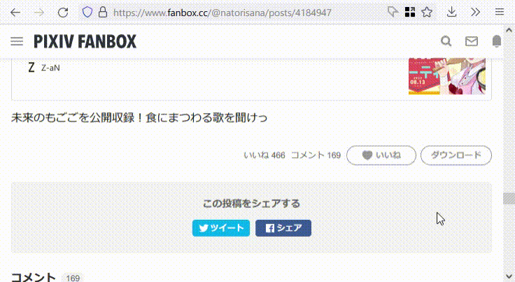

# Fanboxed - Fanbox Downloader



Fanboxの各記事をZIPファイルとしてダウンロードするためのユーザースクリプトです。

## インストール

1. [Greasemonkey]（Firefoxのみ）・[Violentmonkey]・[Tampermonkey]のうち好きな拡張機能をインストールします
1. [fanboxed.user.js]を開きます
1. Greasemonkey（またはViolentmonkey・Tampermonkey）の画面が開くので、画面に従ってインストールしてください

## 使い方

### ZIPのダウンロード

Fanboxのリストページや記事ページを開くと、いいねボタンの横に「ダウンロード」ボタンが生えます。
このボタンをクリックすることで、記事に含まれる画像や本文がZIPにまとめられてダウンロードされます。
ただし、閲覧に必要なプランに加入していない場合はダウンロードボタンは生えません。

ZIPファイルは下記のような構造で構成されます。
<pre style="font-family: monospace">
┣ cover.jpeg　　　 記事のカバー画像（ある場合）。拡張子は元ファイルに合わせられます
┣ description.txt　記事本文（ある場合）
┣ page_001.png　　 記事中の画像1ページ目（ある場合）。拡張子は元ファイルに合わせられます
┣ page_002.png　　 2ページ目
┗ page_xxx.png　　 ファイルは先頭から連番で保存されます
</pre>

### ZIPのファイル名

ZIPファイルは、デフォルトでは「[2020-12-23] [作者名] 記事タイトル.zip」といった形式のファイル名で保存されます。
このファイル名はスクリプト冒頭の`const FORMAT_FILENAME = "なんたらかんたら.zip";`の部分を書き換えることで変更できます。
以下のように書き換えてみてください。

（ただしスクリプトを書き換える都合上、アップデートや再インストール時にはリセットされてしまうため注意してください。
設定画面はそのうち作ると思います）

```javascript
// デフォルト：[2020-12-23] [作者名] タイトル
const FORMAT_FILENAME = "[{year:04}-{month:02}-{day:02}] [{author}] {title}.zip";

// 作者名を削る：[2020-12-23] タイトル
const FORMAT_FILENAME = "[{year:04}-{month:02}-{day:02}] {title}.zip";

// 日付に加えて時分も入れてみる：[2020-12-23 0000] タイトル
const FORMAT_FILENAME = "[{year:04}-{month:02}-{day:02} {hour:02}{minute:02}] {title}.zip";
```

形式化文字列はPython風ですが、書式指定は今のところゼロ埋め（`:0XXX`の形）にのみ対応しています。使用できる変数は以下の通りです。
| 変数名   | 概要         |
|----------|--------------|
| `author` | 作者名       |
| `title`  | 記事タイトル |
| `year`   | 記事投稿年   |
| `month`  | 記事投稿月   |
| `day`    | 記事投稿日   |
| `hour`   | 記事投稿時   |
| `minute` | 記事投稿分   |

[Greasemonkey]: https://addons.mozilla.org/ja/firefox/addon/greasemonkey/
[Violentmonkey]: https://violentmonkey.github.io/
[Tampermonkey]: https://www.tampermonkey.net/
[fanboxed.user.js]: https://raw.githubusercontent.com/aznhe21/fanboxed/master/fanboxed.user.js
